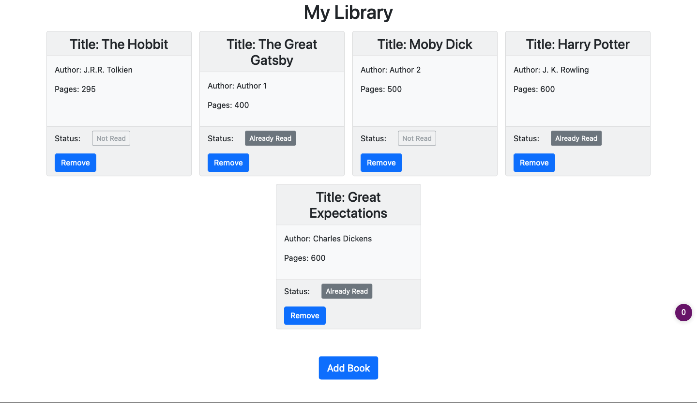

# Library Project

> This is a simple JS library app that allows users to add and remove books to their collection.

Features:
- add a book to the library
- remove a book
- toggle the status of a book between two states: already read and not read yet
- return information about a book through the **info** function of a book object

## Built With

- HTML, CSS, JS
- Bootstrap
- ESLint, Stylint, WebHint
- VS Code

## Live Demo

[Live Demo Link](https://starsheriff2.github.io/Library-project/)

## Getting Started

To get a local copy up and running, follow these simple example steps.

### Prerequisites
- Browser to open **index.html** file
### Setup
1. Open your terminal or command prompt.
2. If you do not have git installed in your system, skip this step and go to step 3; otherwise, go to the directory where you want to copy the project files and clone it by copying this text into your command prompt/terminal: `git@github.com:StarSheriff2/Library-project.git`.
 Now go to ***"Usage"*** section
3. Download the program files by clicking on the green button that says “**Code**“ on the upper right side of the project frame.
4. You will see a dropdown menu. Click on “**Download ZIP**“.
5. Go to the directory where you downloaded the **ZIP file** and open it. Extract its contents to any directory you want in your system.

### Linters
To run the linters included in this repository, you will need to install them locally. **Note:** You will need node.js for this and npm:
- to install WebHint, run `npm install --save-dev hint@6.x`
- for Stylelint, `npm install --save-dev stylelint@13.x stylelint-scss@3.x stylelint-config-standard@21.x stylelint-csstree-validator@1.x`
- for ESlint, `npm install --save-dev eslint@7.x eslint-config-airbnb-base@14.x eslint-plugin-import@2.x babel-eslint@10.x`

To run the linters, go the root directory of your repository, and copy/paste the following commands in your terminal:
- to check the HTML file, `npx hint .`
- to check the stylesheets, `npx stylelint "**/*.{css,scss}"`
- to check the JS files, `npx eslint .`

### Usage
- Open the index.html file in the project root folder with your browser of choice.
- Enjoy

## Authors

👤 **Arturo Alvarez**
- Github: [@StarSheriff2](https://github.com/StarSheriff2)
- Twitter: [@ArturoAlvarezV](https://twitter.com/ArturoAlvarezV)
- Linkedin: [Arturo Alvarez](https://www.linkedin.com/in/arturoalvarezv/)

👤 **Author2**

- GitHub: [@abmAsadullah](https://github.com/abmAsadullah)
- LinkedIn: [A B M Asadullah](https://www.linkedin.com/in/abmasadullah/)

## 🤝 Contributing

Contributions, issues, and feature requests are welcome!

Feel free to check the [issues page](https://github.com/StarSheriff2/Library-project/issues).

## Show your support

Give an ⭐️ if you like this project!

## 📝 License

This project is [MIT](./MIT.md) licensed.
